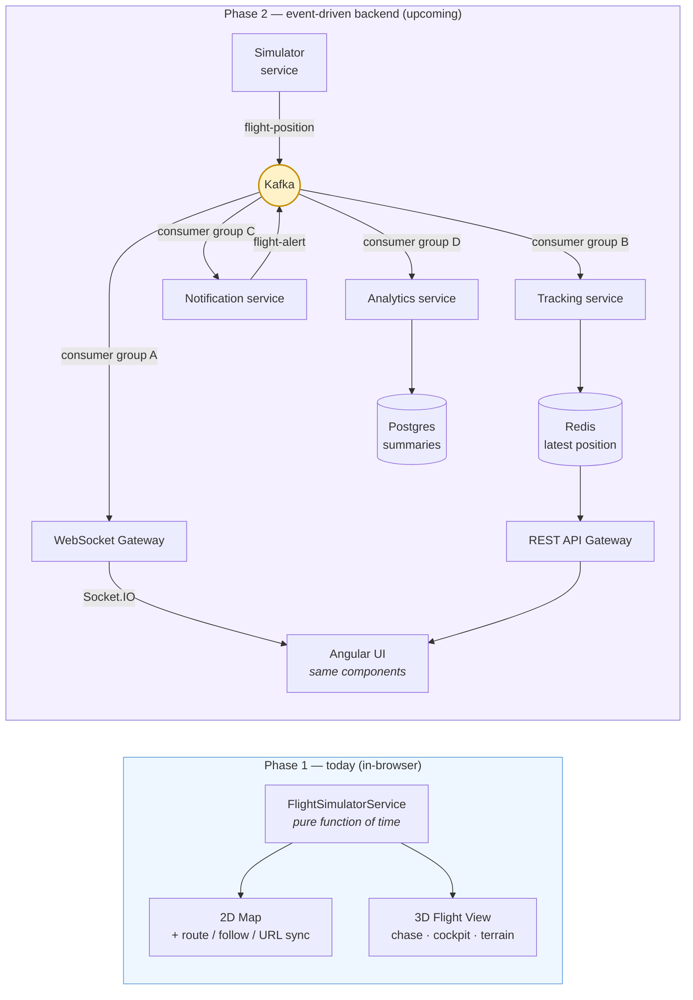

# ✈️ PlaneTracker

A live flight tracker built in Angular 19 — simulated aircraft moving along real great-circle routes across continents, with a Google Maps 2D view and a Three.js 3D chase-camera view (plus a cockpit mode). Designed as the frontend for a future event-driven backend, so every model is shaped like the Kafka event that will eventually feed it.


> **Status:** Phase 1 (frontend) complete. Phase 2 (Kafka + Node microservices + Redis + Postgres) in progress — see [`docs/BACKEND_ROADMAP.md`](docs/BACKEND_ROADMAP.md).

---

## Architecture

Today the simulator runs in the browser; Phase 2 moves it behind Kafka and adds fan-out consumers. Because the `Aircraft` model is already shaped as the future `flight-position` event, the UI won't change when the data source flips.



---

## What it does

**20 aircraft** on intercontinental routes (JFK↔LHR, DXB↔SIN, NRT↔SYD, LHR↔YYZ, and more), continuously simulated in-browser.

### 2D map
- **Great-circle routes** — planes follow real spherical paths, including antimeridian crossings (Seoul → LA takes the Pacific, not Europe)
- **Route overlay** — click a flight to see its flown/remaining path drawn as a great-circle arc; other planes fade out so the route reads clearly
- **Follow mode** — the map pans smoothly (~5 s cadence) to keep the selected plane centred at your current zoom
- **Shareable URL** — pan/zoom updates `/lat,lng/zoom` in the address bar (FR24-style), so any view is a link you can paste
- **Day/night themes** — muted-colourful map by day, dark by night; theme swap propagates everywhere
- **Info panel** — aircraft photo, type, live altitude/speed/heading, progress bar
- **Altitude-scaled markers** with heading rotation and a hover card

### 3D flight view
- **Chase camera** behind the aircraft, with orbit controls (drag to look around)
- **Cockpit view** — first-person camera fixed on the heading, view rolls with the banking
- **Procedural terrain** — vertex-shader displaced fbm noise, textured with CC0 photo maps and normal maps (grass / rock / snow / sand splatting by elevation and slope)
- **Occasional gentle banking** — the plane eases into random ±8–18° rolls between straight-flight periods
- **Wind streaks** off the trailing edges of both wings, speed-scaled
- **Drifting billboard clouds** with parallax scroll
- **Starfield** at night — 820 stars on a fixed dome, cool-blue and warm-yellow tints
- **Radio chatter toggle** for atmosphere
- **Day/night theming** on sky, fog, terrain, clouds, lights

## Tech stack

**Frontend:** Angular 19 (standalone components, signals), TypeScript, RxJS, `@angular/google-maps`, Three.js, GLSL shaders.

**Backend (Phase 2, upcoming):** Node.js, KafkaJS, Apache Kafka (KRaft), Redis, PostgreSQL, Socket.IO, Docker Compose.

## The interesting bits

A few implementation details I enjoyed figuring out:

- **Spherical slerp** for aircraft positions ([`geo.ts`](src/app/utils/geo.ts)) — a linear lat/lng lerp drifts off `geodesic: true` polylines and goes the wrong way across the antimeridian. Slerp fixes both, and because Mercator is conformal, the great-circle bearing matches the on-screen tangent — so headings line up with actual motion for free.
- **Time-based simulator** ([`flight-simulator.service.ts`](src/app/services/flight-simulator.service.ts)) — positions are a *pure function of wall-clock time*, so the render loop can sample at 60 fps for smooth motion while the data still represents a 1 Hz feed. No drift.
- **GPU terrain splatting** ([`terrain.ts`](src/app/components/flight-view-3d/terrain.ts)) — one plane geometry, vertex displacement in a custom shader chunk, biome weights driven by elevation *and* slope in the fragment shader, blended photo textures + normal maps per biome. World-XZ-aligned UVs mean the tangent basis is trivial (no tangent attributes needed).
- **Event-shaped `Aircraft` model** ([`aircraft.model.ts`](src/app/models/aircraft.model.ts)) — deliberately identical to the future Kafka `flight-position` payload, so switching the map's data source from the client simulator to a WebSocket feed later needs no rendering changes.
- **URL-synced view** ([`map.component.ts`](src/app/components/map/map.component.ts)) — Google Maps' `idle` event is a naturally-debounced "movement done" signal, so no manual throttling.

## Getting started

```bash
npm install
ng serve
```

Then open [http://localhost:4200](http://localhost:4200). No backend needed for Phase 1 — the simulator runs entirely in-browser.

> The Google Maps API key must live in `src/environments/environment.ts` (git-ignored). A demo key without billing works for local dev.

## Project structure

```
src/app/
  components/
    map/                    # 2D Google Maps + aircraft markers + route overlay
    flight-view-3d/         # Three.js chase / cockpit view (+ terrain, clouds, stars, trails)
    aircraft-info-panel/    # Selected-flight details panel
    header/                 # Nav + theme toggle
  services/
    flight-simulator.service.ts   # Time-based fleet position generator
    map-theme.service.ts          # Shared day/night signal
    google-maps-loader.service.ts # Async Maps JS API load
    radio.service.ts              # Cockpit radio chatter
  models/                   # Event-shaped domain types
  data/seed-data.ts         # Airports, routes, flight seeds
  utils/geo.ts              # Great-circle math (slerp, bearing, haversine)
public/
  textures/terrain/         # CC0 biome textures — see CREDITS.md
  aircraft/                 # Flight photos (shared across the 20 flights)
```

## Credits

Terrain textures are CC0 from [Poly Haven](https://polyhaven.com) — full attribution in [`public/textures/terrain/CREDITS.md`](public/textures/terrain/CREDITS.md).

## Roadmap

- **Phase 1 — Frontend** ✅
- **Phase 2 — Event-driven backend** 🚧 See [`docs/BACKEND_ROADMAP.md`](docs/BACKEND_ROADMAP.md): Kafka, WebSocket gateway, Tracking service (Redis), REST gateway, notifications, analytics, DLQ resilience.
- **Phase 3 — Feature depth** (post-backend): time-travel replay, geofencing/alerts, fleet ops sidebar, connection-health UX, route-density heatmap.

## Local development notes

Dev server: `ng serve` — hot-reloads on save.
Build: `ng build` — output to `dist/`.
